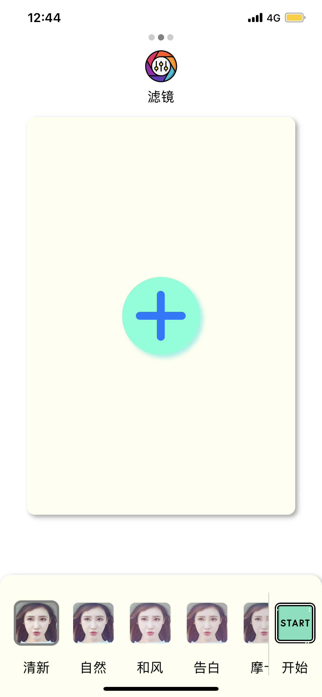
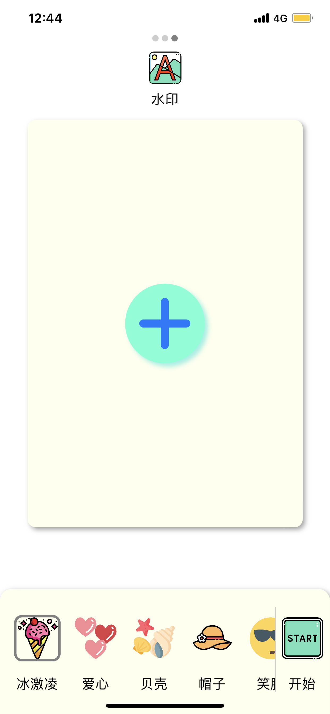

# veil
veil人脸隐私保护软件，利用妆容迁移对抗生成网络，对图片进行改动，防止照片中的人脸数据被用作AI模型的训练数据。

#### 安装方法：在iOS设备中利用Safari点击[此链接](itms-services://?action=download-manifest&url=https://raw.githubusercontent.com/John-ssj/veil/main/manifest.plist)（请确保手机可以流畅链接github）

